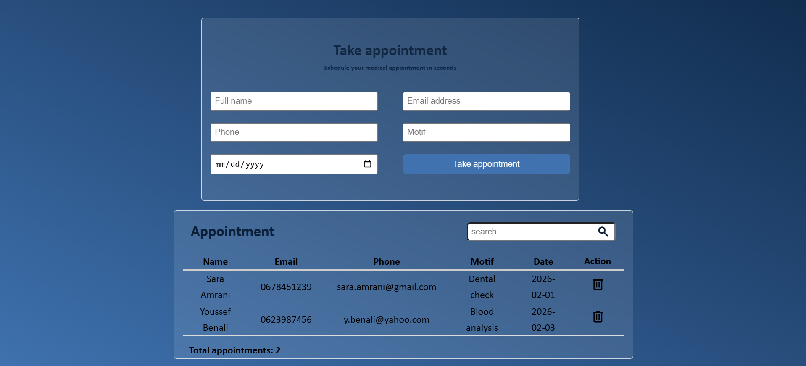
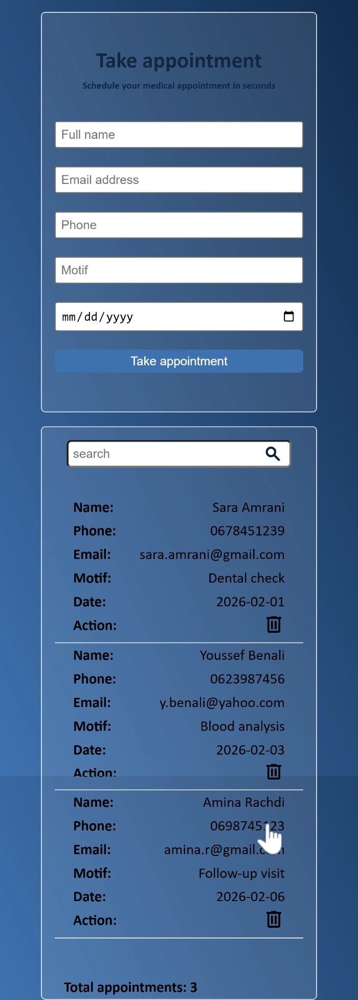

# pre-admission-v2# Pré-admission v2 – Responsive UI

## Overview
Pré-admission v2 is a modern and responsive web page for managing clinic pre-admission requests.  
It improves the UI and UX of the existing version while keeping the same core features: add, display, search/filter, and delete requests.

  

  

## Technologies
- HTML5  
- CSS3 (Responsive)  
- JavaScript  
- Git & GitHub  

## Features
- Pre-admission form (Name, Phone, Email, Reason, Date)
- Dynamic request counter
# Pré-admission v2 – Responsive UI

## Overview
Pré-admission v2 is a modern and responsive web page for managing clinic pre-admission requests.  
It improves the UI and UX of the existing version while keeping the same core features: add, display, search/filter, and delete requests.

## Technologies
- HTML5  
- CSS3 (Responsive, CSS Variables)  
- JavaScript  
- Git & GitHub  

## Features
- Pre-admission form (Name, Phone, Email, Reason, Date)
- Dynamic request counter
- error UI messages
- Add, display, and delete requests
- Search functionality
- Fully responsive (mobile, tablet, desktop)

## Author
**Mehdi elhajjame** 2026
